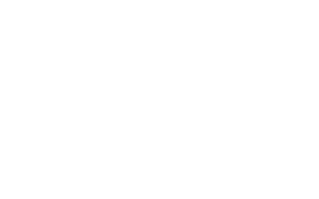

# Пробная Инструкция по работе с Markdown

## `1. Выделение текста`

Чтобы выделить текст курсивом, необходимо обрамить его звездочками `*`. или знаком нижнего подчеркивания `_`.
Например, *вот так* или _вот так_

Чтобы выделить текст полужирным, необходимо обрамить его двойными звездочками `**` или двойным знаком нижнего подчеркивания `__`.
Например, **вот так** или __вот так__.

Альтернативные способы выделения текста жирным или курсивом нужны для того, чтобы мы могли совмещать оба этих способа. Например, _текст может быть выделен курсивом и при этом быть **полужирным**._


## `2. Списки`

Чтобы добавить ненумерованные списки, необходимо пункты выделить звездочкой `*` или знаком `+`.
Например, вот так:
```
* Элемент 1
* Элемент 2
+ Элемент 3
```
Результат:
* Элемент 1
* Элемент 2
+ Элемент 3

Чтобы добавить нумерованные списки, необходимо пункты просто пронумеровать.
Например, вот так:
```
1. Первый пункт
2. Второй пункт
3. Третий пункт
```
Результат:
1. Первый пункт
2. Второй пункт
3. Третий пункт

## `3. Работа с изображениями`

Чтобы вставить изображение в текст, достаточно написать следующее:
```

```
Результат:


## `4. Ссылки`

Чтобы добавить ссылку и указать название, необходимо сперва в квадратных скобках указать название, затем в круглых скопках саму ссылку.

```
[пример](https://gist.github.com/Jekins/2bf2d0638163f1294637 "Статья про Markdown")
```
Результат:
[пример](https://gist.github.com/Jekins/2bf2d0638163f1294637 "Статья про Markdown")

## `5. Работа с таблицами`

Чтобы добавить таблицу, необходио использовать использовать следующий код:
```
First Header  | Second Header
------------- | -------------
Content Cell  | Content Cell
Content Cell  | Content Cell
```

Для выравнивания текста использовать (:)

`:----` Выравнивание по левому краю;

`:---:` Выравнивание по центру;

`----:` Выравнивание по правому краю.

Выравнивание слева | выравнивание по центру | выравнивание справа
:----- | :----: | -----:
A1     |B1      |C1   
A2     |B2      |C2
A3     |B3      |C3

Пропускаем строчку и мы выходим за пределы таблицы.

## `6. Цитаты`

Цитаты оформляются как в емейлах, с помощью символа `>`.

Пример:
```
>  Пример цитаты
>> Вложенная цитата

и так далее

> На последок еще 1 цитата. Чтобы понять наверняка.
```
Результат:

>  Пример цитаты
>> Вложенная цитата

и так далее

> На последок еще 1 цитата. Чтобы наверняка.

## `7. Заключение`

В инструкции указаны далеко не все возможности языка разметки `Markdown`

### Источники:
* [Статья на GitHub](https://gist.github.com/Jekins/2bf2d0638163f1294637 "Статья от Jekins")
* [Краткое руководство по Маркдауну](https://paulradzkov.com/2014/markdown_cheatsheet/ "Статья от Павел Радьков")

Надеюсь, данная статья поможет новичкам!